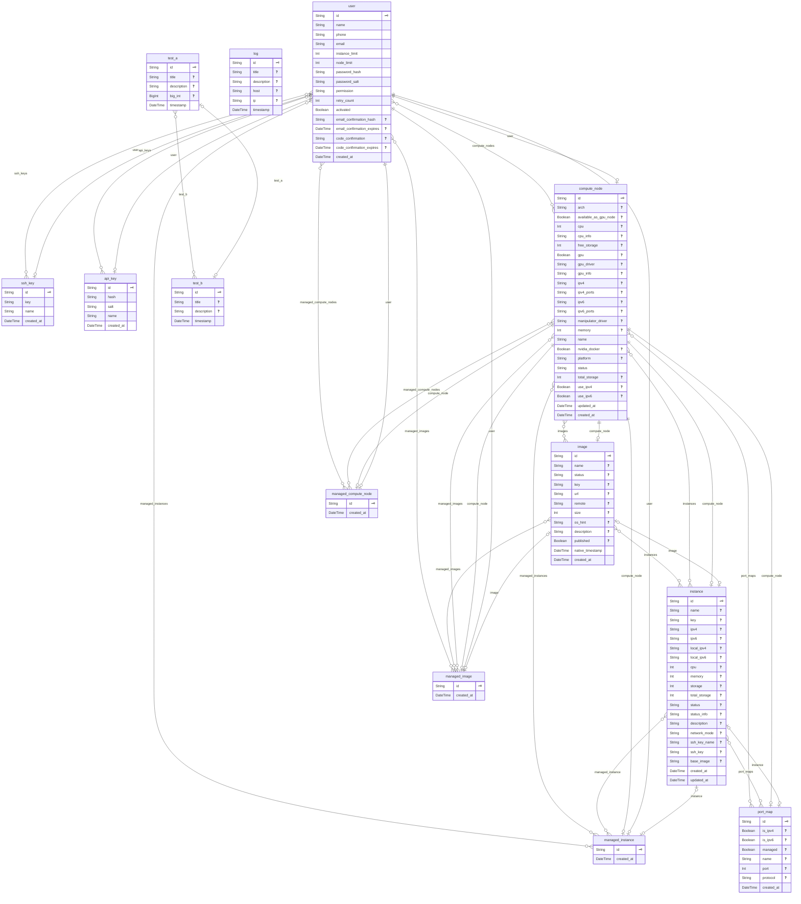

```mermaid
erDiagram

  "user" {
    String id "🗝️"
    String name 
    String phone 
    String email 
    Int instance_limit 
    Int node_limit 
    String password_hash 
    String password_salt 
    String permission 
    Int retry_count 
    Boolean activated 
    String email_confirmation_hash "❓"
    DateTime email_confirmation_expires "❓"
    String code_confirmation "❓"
    DateTime code_confirmation_expires "❓"
    DateTime created_at 
    }
  

  "ssh_key" {
    String id "🗝️"
    String key 
    String name 
    DateTime created_at 
    }
  

  "api_key" {
    String id "🗝️"
    String hash 
    String salt 
    String name 
    DateTime created_at 
    }
  

  "image" {
    String id "🗝️"
    String name "❓"
    String status "❓"
    String key "❓"
    String url "❓"
    String remote "❓"
    Int size "❓"
    String os_hint "❓"
    String description "❓"
    Boolean published "❓"
    DateTime native_timestamp 
    DateTime created_at 
    }
  

  "compute_node" {
    String id "🗝️"
    String arch "❓"
    Boolean available_as_gpu_node "❓"
    Int cpu "❓"
    String cpu_info "❓"
    Int free_storage "❓"
    Boolean gpu "❓"
    String gpu_driver "❓"
    String gpu_info "❓"
    String ipv4 "❓"
    String ipv4_ports "❓"
    String ipv6 "❓"
    String ipv6_ports "❓"
    String manipulator_driver "❓"
    Int memory "❓"
    String name 
    Boolean nvidia_docker "❓"
    String platform "❓"
    String status 
    Int total_storage "❓"
    Boolean use_ipv4 "❓"
    Boolean use_ipv6 "❓"
    DateTime updated_at 
    DateTime created_at 
    }
  

  "instance" {
    String id "🗝️"
    String name "❓"
    String key "❓"
    String ipv4 "❓"
    String ipv6 "❓"
    String local_ipv4 "❓"
    String local_ipv6 "❓"
    Int cpu "❓"
    Int memory "❓"
    Int storage "❓"
    Int total_storage "❓"
    String status "❓"
    String status_info "❓"
    String description "❓"
    String network_mode "❓"
    String ssh_key_name "❓"
    String ssh_key "❓"
    String base_image "❓"
    DateTime created_at 
    DateTime updated_at 
    }
  

  "managed_compute_node" {
    String id "🗝️"
    DateTime created_at 
    }
  

  "managed_image" {
    String id "🗝️"
    DateTime created_at 
    }
  

  "managed_instance" {
    String id "🗝️"
    DateTime created_at 
    }
  

  "port_map" {
    String id "🗝️"
    Boolean is_ipv4 "❓"
    Boolean is_ipv6 "❓"
    Boolean managed "❓"
    String name "❓"
    Int port "❓"
    String protocol "❓"
    DateTime created_at 
    }
  

  "log" {
    String id "🗝️"
    String title "❓"
    String description "❓"
    String host "❓"
    String ip "❓"
    DateTime timestamp 
    }
  

  "test_a" {
    String id "🗝️"
    String title "❓"
    String description "❓"
    BigInt big_int "❓"
    DateTime timestamp 
    }
  

  "test_b" {
    String id "🗝️"
    String title "❓"
    String description "❓"
    DateTime timestamp 
    }
  
    "user" o{--}o "ssh_key" : "ssh_keys"
    "user" o{--}o "api_key" : "api_keys"
    "user" o{--}o "compute_node" : "compute_nodes"
    "user" o{--}o "managed_compute_node" : "managed_compute_nodes"
    "user" o{--}o "managed_image" : "managed_images"
    "user" o{--}o "managed_instance" : "managed_instances"
    "ssh_key" o|--|| "user" : "user"
    "api_key" o|--|| "user" : "user"
    "image" o|--|| "compute_node" : "compute_node"
    "image" o{--}o "instance" : "instances"
    "image" o{--}o "managed_image" : "managed_images"
    "compute_node" o|--|| "user" : "user"
    "compute_node" o{--}o "image" : "images"
    "compute_node" o{--}o "instance" : "instances"
    "compute_node" o{--}o "port_map" : "port_maps"
    "compute_node" o{--}o "managed_compute_node" : "managed_compute_nodes"
    "compute_node" o{--}o "managed_image" : "managed_images"
    "compute_node" o{--}o "managed_instance" : "managed_instances"
    "instance" o{--}o "managed_instance" : "managed_instance"
    "instance" o{--}o "port_map" : "port_maps"
    "instance" o|--|| "compute_node" : "compute_node"
    "instance" o|--|o "image" : "image"
    "managed_compute_node" o|--|| "compute_node" : "compute_node"
    "managed_compute_node" o|--|| "user" : "user"
    "managed_image" o|--|| "compute_node" : "compute_node"
    "managed_image" o|--|| "user" : "user"
    "managed_image" o|--|o "image" : "image"
    "managed_instance" o|--|| "compute_node" : "compute_node"
    "managed_instance" o|--|| "user" : "user"
    "managed_instance" o|--|o "instance" : "instance"
    "port_map" o|--|| "compute_node" : "compute_node"
    "port_map" o|--|o "instance" : "instance"
    "test_a" o{--}o "test_b" : "test_b"
    "test_b" o|--|o "test_a" : "test_a"
```
